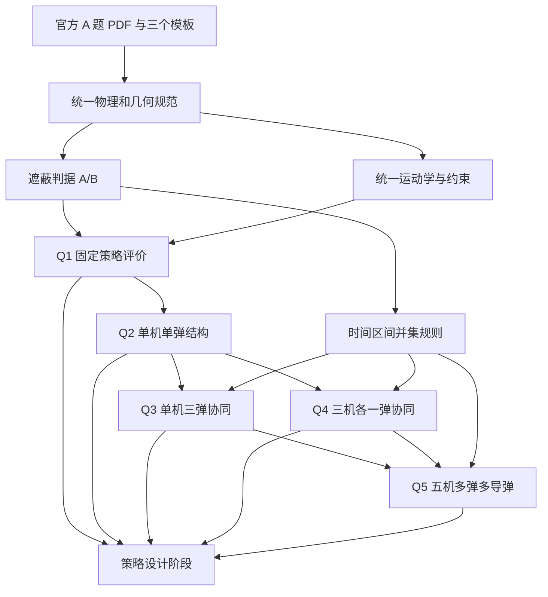

# 问题依赖图与阶段交付

## 1. 总体依赖

箭头表示定义、约束或验证证据依赖，不表示必须照搬前一问的数值策略。

## 2. 可复用基础模块

| 基础规范 | 被哪些问题复用 | 必须保持一致的内容 |
|---|---|---|
| 坐标与实体 | Q1–Q5 | 假目标、真实圆柱、导弹和无人机初始位置 |
| 导弹运动 | Q1–Q5 | 300 m/s、直指原点、固定直线、到达时间域 |
| 无人机运动 | Q1–Q5 | 瞬时调向后等高匀速直线、70–140 m/s、航向速度固定 |
| 烟幕弹运动 | Q1–Q5 | 投放后重力运动、投放/起爆点的派生关系 |
| 云团演化 | Q1–Q5 | 半径 10 m、中心下沉 3 m/s、有效 20 s |
| 遮蔽判据 | Q1–Q5 | 圆柱完全遮蔽主模型、中心点 baseline |
| 时间聚合 | Q3–Q5 | 同一导弹按区间并集计时 |
| 模板映射 | Q3–Q5 | 不修改官方模板，仅填写复制件 |

## 3. 每问最小输入、输出与依赖

### Q1

- 输入：FY1、M1 初始位置，FY1 固定航向/速度，固定投放时刻和引信延时，统一遮蔽判据。
- 输出：主模型与 baseline 的有效遮蔽时间区间及总时长。
- 作用：验证统一运动学、时间基准和遮蔽判据是否自洽。
- 不依赖：任何待选优化路线。

### Q2

- 输入：Q1 已核验的单弹前向物理模型。
- 输出：FY1 的航向、速度、投放/起爆时刻与点，以及最大 M1 遮蔽时间。
- 依赖：Q1 的几何和时间定义，而不是 Q1 的固定参数值。
- 向后提供：单机单弹可行域、派生点计算和个体遮蔽区间。

### Q3

- 输入：Q2 的单弹决策结构；同机三弹共享航向速度；1 s 投放间隔。
- 输出：三枚弹完整策略、各自遮蔽区间、M1 区间并集、`result1.xlsx` 复制件。
- 关键新增：多弹时序耦合和重叠去重。
- 不得做：把三个单弹最优解机械拼接后直接相加时长。

### Q4

- 输入：Q2 的单弹结构；FY1–FY3 初始位置；各机可有不同航向速度。
- 输出：三机各一弹完整策略、M1 区间并集、`result2.xlsx` 复制件。
- 关键新增：多平台空间可达性和跨平台时间协调。
- 与 Q3 的关系：二者都复用 Q2，但一个是“同机多弹”，另一个是“多机单弹”，可以并行比较结构差异。

### Q5

- 输入：Q2 的单弹物理可行域、Q3 的同机多弹约束、Q4 的多机协调结构、三枚导弹各自视线几何。
- 输出：FY1–FY5 每机 0–3 枚弹的使用、时序、目标指派、三枚导弹分项并集时长、总目标值、`result3.xlsx` 复制件。
- 关键新增：弹数选择、目标指派、不同导弹的时间域与遮蔽几何，以及跨导弹目标聚合。
- 硬要求：M1、M2、M3 均得到实质有效干扰；不能以牺牲某枚导弹为代价把全部资源投向单一目标而仍宣称完成题意。

## 4. 官方附件映射

| 文件 | 对应问题 | 预置策略行 | 重要限制 |
|---|---|---:|---|
| `result1.xlsx` | Q3 | FY1 三枚弹 | 无投放/起爆时刻列，时刻须另存 |
| `result2.xlsx` | Q4 | FY1、FY2、FY3 各一行 | 无投放/起爆时刻列 |
| `result3.xlsx` | Q5 | 5 架无人机 × 3 弹位，共 15 行 | 有目标导弹编号列；未使用弹位应按官方格式留空 |

所有模板均为只读权威输入。后续只能复制到 `submission/` 后填写。

## 5. 阶段关卡

| 关卡 | 当前状态 | 进入条件/证据 |
|---|---|---|
| 输入关卡 | PASS | 官方中文版发布包、A 题 PDF、三个模板及 SHA-256 已核验 |
| 分解关卡 | PASS | 本目录四份正式规范完成 |
| 路线关卡 | OPEN | 下一阶段比较可核验的建模/求解路线；尚未选择 |
| 执行关卡 | CLOSED | 需先有明确路线、目标输出和验证计划 |
| 写作关卡 | CLOSED | 需固定模型/配置并取得实际结果 |
| 提交关卡 | CLOSED | 需完成全部结果、模板复制件和一致性审计 |

## 6. 下一阶段的精确交付物

下一 Skill：`$math-modeling-strategy-designer`。

最小交付物应比较：

1. 连续圆柱完全遮蔽判据的可计算表达与误差控制方案；
2. 连续时间有效区间的可靠识别方式；
3. Q2–Q5 决策结构随维度增长的可扩展路线；
4. 中心点 baseline 与圆柱主模型的公平对照；
5. Q5 跨导弹目标口径的主指标和敏感性指标；
6. 每条候选路线的可复现性、精度、复杂度与失败风险。

本阶段未选择任何算法，也没有生成求解代码。

**READY FOR STRATEGY DESIGN**

